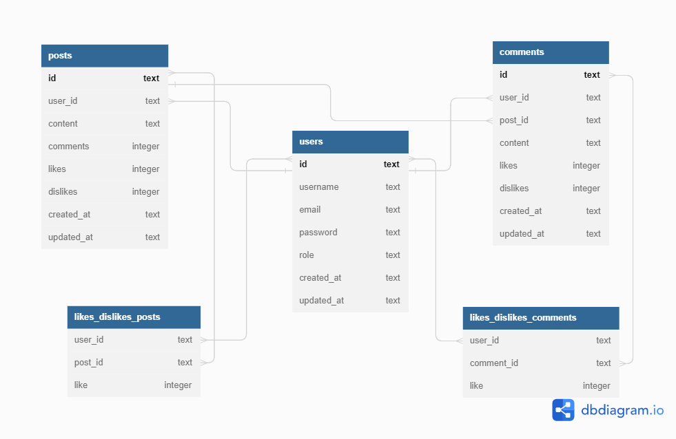

# projeto-labeddit-backend

O projeto Labeddit-Backend é o projeto de uma API desenvolvida para uma rede social, com o objetivo de promover a conexão e interação entre pessoas. Quem se cadastrar no aplicativo poderá criar e curtir publicações.

Este projeto foi desenvolvido com base em POO e arquitetura em camadas, onde são realizadas operações CRUD com as entidades users, posts e comments, vinculados ao banco de dados SQLite.

## **Documentação da API:**

[Clique aqui!](https://documenter.getpostman.com/view/25826777/2s93m8yKse)

## **Link deploy:**
https://deploy-projeto-labeddit.onrender.com

## **Link repositório frontend:**
https://github.com/AnaliceMarques/projeto-labeddit-frontend

## **Funcionalidades do Projeto**

- [x] Cadastrar um novo usuário e devolver um token jwt;
- [x] Fazer login do usuários e devolver um token jwt;
- [x] Acessar todos os usuários (disponível apenas para users ADMIN);
- [x] Editar o cadastro do usuário,
- [x] Deletar o usuário,
- [x] Fazer um post;
- [x] Visualizar todos os posts;
- [x] Editar post;
- [x] Deletar post;
- [x] Dar like ou dislike em um post.
- [x] Fazer um comentário em um post;
- [x] Visualizar todos os comentários do post;
- [x] Editar comentário;
- [x] Deletar comentário;
- [x] Dar like ou dislike em um comentário.

## **Regras de Negócio**

- Um e-mail só pode ter um cadastro;
- As funcionalidades referentes a entidade posts e comments só podem ser realizadas por usuários cadastrados, através da informação do token obtido quando realizado o cadastro ou login;
- Apenas o usuário que criou o post ou cometário pode editá-lo, e somente o conteúdo pode ser editado;
- Apenas o usuário que criou o post ou cometário pode deletá-lo;
- Contas Admins podem deletar o post ou cometário de qualquer usuário;
- O usúario não consegue dar like ou dislike em seus próprios posts ou cometário ;
- Caso usuário dê um like em um post ou cometário que já tenha dado like, o like é desfeito;
- Caso usuário dê um dislike em um post ou cometário que já tenha dado dislike, o dislike é desfeito;
- Caso usuário dê um like em um post ou cometário que tenha dado dislike, o like sobrescreve o dislike;
- Caso usuário dê um dislike em um post ou cometário que tenha dado like, o dislike sobrescreve o like

## **Estrutura do Banco de Dados**



## **Tecnologias Utilizadas**

- Node.js
- Typescript
- Express
- Knex
- SQLite
- Zod
- UUID
- Bcrypt
- JWT

## **Programas utilizados**

- VS Code
- Postman
- Render

## **Como rodar este projeto?**

```bash
# Clone este repositório
$ git clone https://github.com/AnaliceMarques/projeto-labeddit-backend.git

# Acesse a pasta do projeto no seu terminal
$ cd projeto-labeddit-backend

# Instale as dependências
$ npm install

# Execute a aplicação no servidor
$ npm run dev

# A aplicação será iniciada na porta 3003

# Use um API Client para testar as rotas da aplicação
```

## **Próximos passos**

- [ ] Testes unitários;

## **Contato**

e-mail: analicemarquessl@gmail.com

Linkedin: https://www.linkedin.com/in/analicemarquessl
